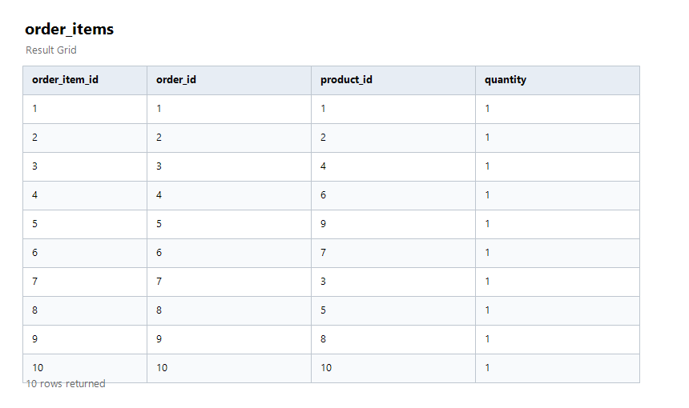
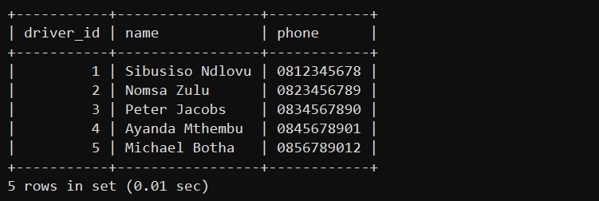
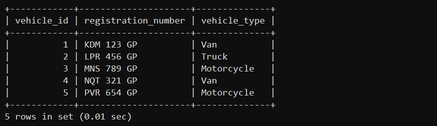
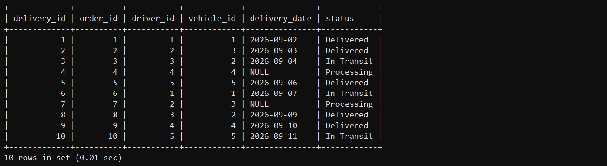

Delivery & Logistics Data Engineering Project
Overview

This project models the core data required by a delivery company: customers, products, orders, order items, drivers, vehicles, and deliveries. It is being built as a practical data-engineering project using MySQL, SQL, Python, and Pandas.

Work completed today
Created the MySQL database setup script.
Created seven related tables with primary keys, foreign keys, and appropriate constraints.
Added an initial data-seeding script for the customers table.
Inserted 10 sample customers from Gauteng-area locations to support testing and future analysis.
Added 10 sample products, 10 customer orders, 10 order items, 5 drivers, 5 vehicles, and 10 delivery assignments.
Documented the database design and the relationships between the tables.
Wrote JOIN queries combining customers, orders, order_items, products, drivers, and vehicles into meaningful views.
Used LEFT JOIN queries to find customers with no orders, products never ordered, and delivery counts per driver.
Wrote analytics queries: totals (revenue by status/category/product/customer), averages (order value, price, delivery time), and counts by group (customers per city, deliveries per driver/vehicle/status).
Sample data

The seeded customer, product, order, driver, vehicle, and delivery data can be viewed in the project screenshots.

### Customers


### Orders


### Order Items



### Drivers



### Vehicles



### Deliveries



## Technologies

- MySQL
- SQL
- Python
- Pandas
- Git and GitHub

## Database schema

The `delivery_db` database contains the following tables:

- `customers`: customer contact and location details
- `products`: products available to purchase
- `orders`: orders placed by customers
- `order_items`: junction table connecting orders and products
- `drivers`: delivery-driver details
- `vehicles`: delivery-vehicle details
- `deliveries`: delivery assignment and status information

Key relationships:

- A customer can place many orders.
- An order can contain many products through `order_items`.
- A driver and a vehicle can each be assigned to many deliveries.
- Each delivery is linked to an order, driver, and vehicle.

For a fuller description, see [the database design documentation](sql/database_design.md).

## Project structure

.
|-- data/                 # Source and processed data files
|-- python/               # ETL and analysis scripts
|-- screenshots/          # Project screenshots
`-- sql/
    |-- 01_create_database.sql
    |-- 02_create_tables.sql
    |-- 03_insert_data.sql
    |-- 04_insert_products.sql
    |-- 05_insert_orders.sql
    |-- 06_insert_drivers.sql
    |-- 07_insert_vehicles.sql
    |-- 08_insert_deliveries.sql
    |-- 09_insert_order_items.sql
    |-- 10_join_queries.sql
    |-- 11_analytics_queries.sql
    `-- database_design.md

## Running the database scripts

Run the SQL files in this order in MySQL:

1. `sql/01_create_database.sql`: creates `delivery_db`.
2. `sql/02_create_tables.sql`: creates the seven tables and their relationships.
3. `sql/03_insert_data.sql`: loads the initial customer sample data.
4. `sql/04_insert_products.sql`: loads the product sample data.
5. `sql/05_insert_orders.sql`: loads the order sample data.
6. `sql/06_insert_drivers.sql`: loads the driver sample data.
7. `sql/07_insert_vehicles.sql`: loads the vehicle sample data.
8. `sql/08_insert_deliveries.sql`: loads the delivery sample data.
9. `sql/09_insert_order_items.sql`: loads the order-item sample data.
9. `sql/09_insert_order_items.sql`: loads the order-item sample data.
10. `sql/10_join_queries.sql`: runs JOIN queries across the tables (customer orders, delivery details, and gaps like customers with no orders).
11. `sql/11_analytics_queries.sql`: runs analytics queries (totals, averages, counts by group, and a data-quality check).

For example, from a MySQL client:

```sql
SOURCE sql/01_create_database.sql;
SOURCE sql/02_create_tables.sql;
SOURCE sql/03_insert_data.sql;
SOURCE sql/04_insert_products.sql;
SOURCE sql/05_insert_orders.sql;
SOURCE sql/06_insert_drivers.sql;
SOURCE sql/07_insert_vehicles.sql;
SOURCE sql/08_insert_deliveries.sql;
SOURCE sql/09_insert_order_items.sql;
SOURCE sql/10_join_queries.sql;
SOURCE sql/11_analytics_queries.sql;
```

## Next steps

- Build a Python/Pandas ETL pipeline to clean and transform source data. **Completed:** `python/etl_pipeline.py` reads the CSV files in `data/raw/`, standardizes text, parses dates and numeric values, validates required fields and foreign-key relationships, and writes cleaned files to `data/processed/`.
- Load cleaned data into the database via the ETL pipeline. **Completed:** the pipeline upserts cleaned rows into MySQL in foreign-key order.
- Produce business insights and visualisations from the completed dataset.

## Running the Pandas ETL pipeline

Install the Python dependencies:

```bash
python -m pip install -r requirements.txt
```

Run the cleaning and validation step without changing MySQL:

```bash
python python/etl_pipeline.py --dry-run
```

The dry run creates cleaned CSV files in `data/processed/`. To load them into `delivery_db`, first run the database setup scripts above, then set the connection variables and run the pipeline:

```powershell
$env:DB_HOST = "localhost"
$env:DB_PORT = "3306"
$env:DB_USER = "root"
$env:DB_PASSWORD = "your-password"
$env:DB_NAME = "delivery_db"
python python/etl_pipeline.py
```

The loader uses `INSERT ... ON DUPLICATE KEY UPDATE`, so the same source files can be loaded again without creating duplicate records. The raw CSV files are deliberately small sample inputs matching the existing SQL seed data and can be replaced with new extracts that use the same column names.
