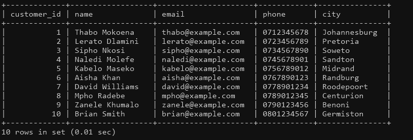
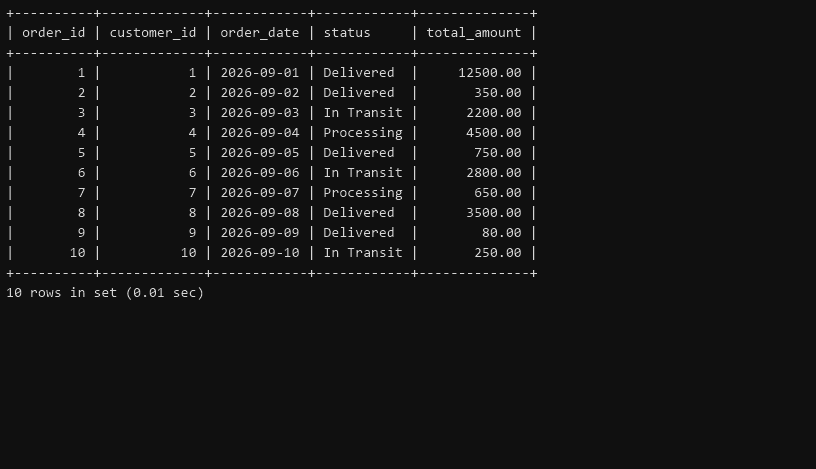

# Delivery & Logistics Data Engineering Project

## Overview

This project models the core data required by a delivery company: customers, products, orders, order items, drivers, vehicles, and deliveries. It is being built as a practical data-engineering project using MySQL, SQL, Python, and Pandas.

## Work completed today

- Created the MySQL database setup script.
- Created seven related tables with primary keys, foreign keys, and appropriate constraints.
- Added an initial data-seeding script for the `customers` table.
- Inserted 10 sample customers from Gauteng-area locations to support testing and future analysis.
- Added 10 sample products and 10 customer orders.
- Documented the database design and the relationships between the tables.

## Sample data

The seeded customer, product, and order data can be viewed in the project screenshots.

### Customers



### Orders



## Technologies

- MySQL
- SQL
- Python
- Pandas
- Git and GitHub

## Database schema

The `delivery_db` database contains the following tables:

- `customers`: customer contact and location details
- `products`: products available to purchase
- `orders`: orders placed by customers
- `order_items`: junction table connecting orders and products
- `drivers`: delivery-driver details
- `vehicles`: delivery-vehicle details
- `deliveries`: delivery assignment and status information

Key relationships:

- A customer can place many orders.
- An order can contain many products through `order_items`.
- A driver and a vehicle can each be assigned to many deliveries.
- Each delivery is linked to an order, driver, and vehicle.

For a fuller description, see [the database design documentation](sql/database_design.md).

## Project structure

```text
.
|-- data/                 # Source and processed data files
|-- python/               # ETL and analysis scripts
|-- screenshots/          # Project screenshots
`-- sql/
    |-- 01_create_database.sql
    |-- 02_create_tables.sql
    |-- 03_insert_data.sql
    |-- 04_insert_products.sql
    |-- 05_insert_orders.sql
    `-- database_design.md
```

## Running the database scripts

Run the SQL files in this order in MySQL:

1. `sql/01_create_database.sql`: creates `delivery_db`.
2. `sql/02_create_tables.sql`: creates the seven tables and their relationships.
3. `sql/03_insert_data.sql`: loads the initial customer sample data.
4. `sql/04_insert_products.sql`: loads the product sample data.
5. `sql/05_insert_orders.sql`: loads the order sample data.

For example, from a MySQL client:

```sql
SOURCE sql/01_create_database.sql;
SOURCE sql/02_create_tables.sql;
SOURCE sql/03_insert_data.sql;
SOURCE sql/04_insert_products.sql;
SOURCE sql/05_insert_orders.sql;
```

## Next steps

- Add sample data for order items, drivers, vehicles, and deliveries.
- Create SQL queries for delivery and customer analysis.
- Build a Python/Pandas ETL pipeline to clean and transform source data.
- Produce business insights and visualisations from the completed dataset.
