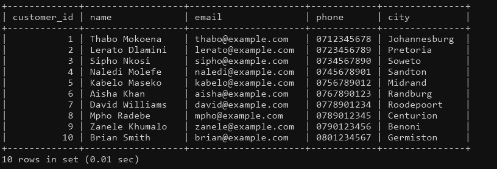
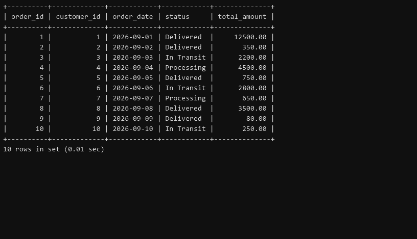
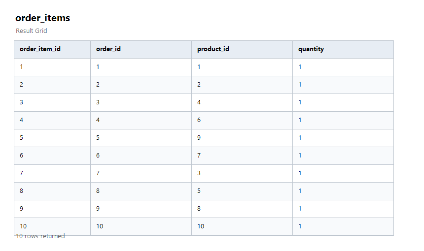
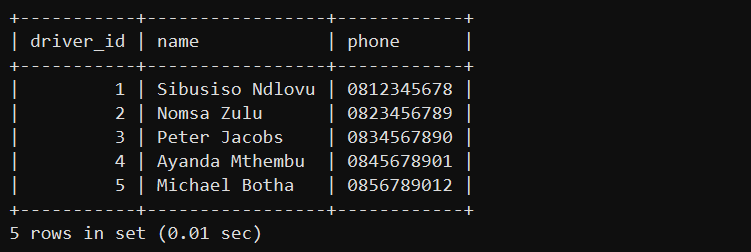
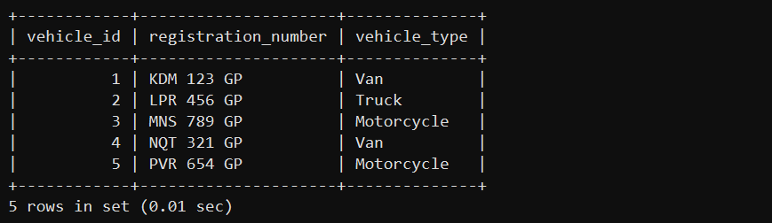
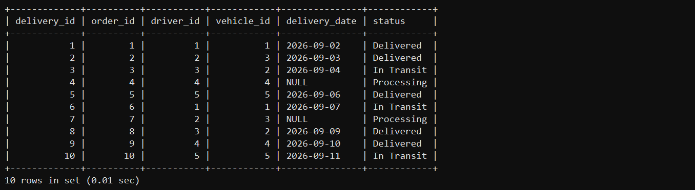

# Delivery & Logistics Data Engineering Project

## Business problem

A modern delivery business needs accurate operational visibility across sales, inventory, and fulfillment. In practice, source data often arrives in inconsistent CSV files with missing values, invalid dates, duplicate keys, and broken relationships between orders, customers, products, drivers, and vehicles.

Without a trusted data pipeline, leaders cannot reliably answer basic business questions such as:

- Which products and categories generate the most revenue?
- Which customers place the highest-value orders?
- Are delivery and order statuses accurate and complete?
- Which drivers and vehicles are being used most effectively?
- Do order totals match the underlying order line items?

## Solution overview

This project addresses that problem by building a complete delivery-data platform using a relational database, ETL pipeline, and analytics layer. It creates a normalized MySQL schema for the core logistics domain, cleans and validates raw data with Python and Pandas, rejects bad records before they reach production, and produces business-ready reporting outputs.

The result is a pragmatic data-engineering solution that demonstrates how to:

- model a delivery business domain in a relational database
- enforce relationships and data-quality constraints
- transform messy source files into reliable analytics data
- surface operational KPIs and revenue insights
- support repeatable, testable data pipelines

## What this project delivers

- A production-style MySQL schema with seven linked tables and integrity rules.
- A deterministic sample-data generator for realistic South African delivery scenarios.
- A Python ETL pipeline that normalizes values, quarantines bad rows, and validates foreign keys.
- SQL analytics for customer, order, product, delivery, and operational summaries.
- Business insights reporting for revenue, averages, and delivery performance.
- Automated regression and ETL-quality tests to keep the pipeline trustworthy.

## Work completed

- Created the MySQL database setup script.
- Created seven related tables with primary keys, foreign keys, and constraints.
- Added initial data-seeding scripts for all core tables.
- Inserted sample customer, product, order, order-item, driver, vehicle, and delivery data.
- Documented the database design and relationships.
- Wrote SQL JOIN queries for customer orders, delivery details, and missing relationships.
- Wrote analytics queries for totals, averages, and grouping by status, category, city, driver, and vehicle.
- Added a deterministic generator for a larger, linked South African delivery demo dataset.
- Built a Python ETL pipeline to clean and validate raw CSV data and load it into MySQL.
- Added automated ETL data-quality tests.
- Added a business-insights dashboard script that generates a revenue summary and chart.

## Sample data

The seeded customer, product, order, driver, vehicle, and delivery data can be viewed in the project screenshots.

### Customers



### Orders



### Order Items



### Drivers



### Vehicles



### Deliveries



## Technologies

- MySQL
- SQL
- Python
- Pandas
- Matplotlib
- Git and GitHub

## Database schema

The `delivery_db` database contains the following tables:

- `customers`: customer contact and location details
- `products`: products available to purchase
- `orders`: orders placed by customers
- `order_items`: junction table connecting orders and products
- `drivers`: delivery-driver details
- `vehicles`: delivery-vehicle details
- `deliveries`: delivery assignment and status information

Key relationships:

- A customer can place many orders.
- An order can contain many products through `order_items`.
- A driver and a vehicle can each be assigned to many deliveries.
- Each delivery is linked to an order, driver, and vehicle.

For a fuller description, see [the database design documentation](sql/database_design.md).

## Project structure

.
|-- data/                 # Raw source and processed output CSV files
|-- python/               # ETL, data generation, and analytics scripts
|-- reports/              # Generated business-summary report and charts
|-- screenshots/          # Project screenshots
|-- sql/
|   |-- 01_create_database.sql
|   |-- 02_create_tables.sql
|   |-- 03_insert_data.sql
|   |-- 04_insert_products.sql
|   |-- 05_insert_orders.sql
|   |-- 06_insert_drivers.sql
|   |-- 07_insert_vehicles.sql
|   |-- 08_insert_deliveries.sql
|   |-- 09_insert_order_items.sql
|   |-- 10_join_queries.sql
|   |-- 11_analytics_query.sql
|   `-- database_design.md
`-- tests/                # Regression and ETL data-quality tests

## Sample dataset

The raw CSVs contain deterministic synthetic data for 250 customers, 35 products, 1,000 orders, 2,273 order items, 30 drivers, 24 vehicles, and 965 deliveries. Order totals match their item quantities and product prices; orders, customers, drivers, and vehicles use valid foreign keys. The original seed rows are retained. These records are for demonstration and are not production data.

Regenerate the raw sample CSVs with:

```bash
python python/generate_sample_data.py
```

Then refresh processed files and validate the dataset:

```bash
python python/etl_pipeline.py --dry-run
```

## Running the database scripts

Run the SQL files in this order in MySQL:

1. `sql/01_create_database.sql`: creates `delivery_db`.
2. `sql/02_create_tables.sql`: creates the seven tables and their relationships.
3. `sql/03_insert_data.sql`: loads the initial customer sample data.
4. `sql/04_insert_products.sql`: loads the product sample data.
5. `sql/05_insert_orders.sql`: loads the order sample data.
6. `sql/06_insert_drivers.sql`: loads the driver sample data.
7. `sql/07_insert_vehicles.sql`: loads the vehicle sample data.
8. `sql/08_insert_deliveries.sql`: loads the delivery sample data.
9. `sql/09_insert_order_items.sql`: loads the order-item sample data.
10. `sql/10_join_queries.sql`: runs JOIN queries across the tables (customer orders, delivery details, and gaps like customers with no orders).
11. `sql/11_analytics_query.sql`: runs analytics queries (totals, averages, counts by group, and a data-quality check).

For example, from a MySQL client:

```sql
SOURCE sql/01_create_database.sql;
SOURCE sql/02_create_tables.sql;
SOURCE sql/03_insert_data.sql;
SOURCE sql/04_insert_products.sql;
SOURCE sql/05_insert_orders.sql;
SOURCE sql/06_insert_drivers.sql;
SOURCE sql/07_insert_vehicles.sql;
SOURCE sql/08_insert_deliveries.sql;
SOURCE sql/09_insert_order_items.sql;
SOURCE sql/10_join_queries.sql;
SOURCE sql/11_analytics_query.sql;
```

## Running the Pandas ETL pipeline

Install the Python dependencies:

```bash
python -m pip install -r requirements.txt
```

The pipeline reads the seven source files from `data/raw/`, writes accepted rows to `data/processed/`, and quarantines rejected rows in `data/rejected/`. Each rejected-row CSV includes the source CSV line number and rejection reason. Valid rows continue through the pipeline; missing source files or required columns stop the run. Use `--rejected-dir` to choose a different quarantine directory. Run the cleaning and validation step without changing MySQL:

```bash
python python/etl_pipeline.py --dry-run
```

To load the cleaned data into MySQL, set the database connection variables and run the pipeline:

```powershell
$env:DB_HOST = "your-mysql-host"
$env:DB_PORT = "3306"
$env:DB_USER = "your-database-user"
$env:DB_PASSWORD = "your-password"
$env:DB_NAME = "delivery_db"
python python/etl_pipeline.py
```

The loader uses `INSERT ... ON DUPLICATE KEY UPDATE`, so reruns update existing records. The processed CSV files remain available to the business-insights script.

## Business insights dashboard

Generate the KPI summary and chart from the processed data set:

```bash
python python/business_insights.py
```

This script reads the cleaned CSVs in `data/processed/`, calculates key metrics such as revenue by category, average order value, and delivery success rate, and writes the outputs to `reports/business_summary.md` and `reports/revenue_by_category.png`.

## Docker quickstart

The project can be run end-to-end with Docker Compose.

1. Copy the sample environment file if you want to override defaults:

```bash
cp .env.example .env
```

2. Start the database and app containers:

```bash
docker compose up --build
```

This will:
- start a MySQL 8 container with the SQL init scripts from `sql/`
- build the Python app container
- generate the sample dataset
- run the ETL pipeline in dry-run mode
- generate the business summary and chart

MySQL is exposed on `localhost:3307` to avoid conflicting with a local MySQL
server already using port `3306`. Containers communicate with MySQL on port
`3306` internally.

3. Open the application shell if you need to run commands manually:

```bash
docker compose exec app bash
```

4. To stop everything:

```bash
docker compose down
```

To persist the MySQL data across restarts, the `mysql_data` volume is created automatically.

## Automated tests

GitHub Actions runs the quality tests on pushes and pull requests. The test workflow needs no API or database secrets and can also be started manually from the Actions tab.

## Validation

Run the automated regression and ETL data-quality tests:

```bash
python -m unittest discover -s tests
```

The checks cover CSV extraction, schema normalization, required values, duplicate primary keys, invalid dates and quantities, foreign-key relationships, and rejected-row output.
